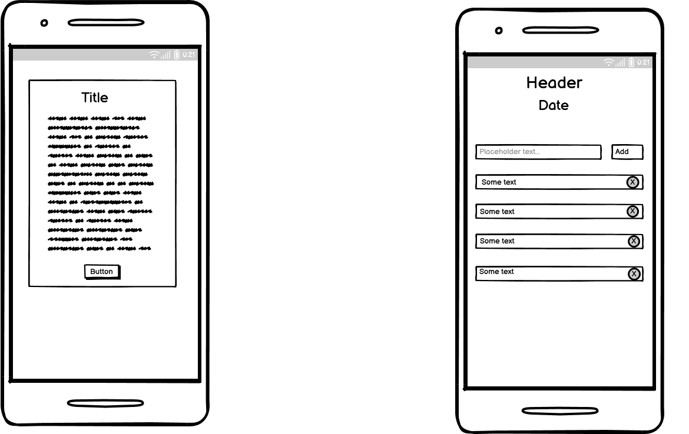
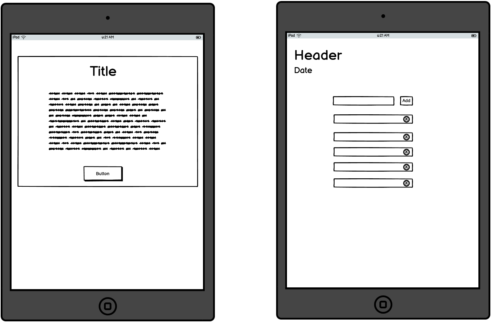
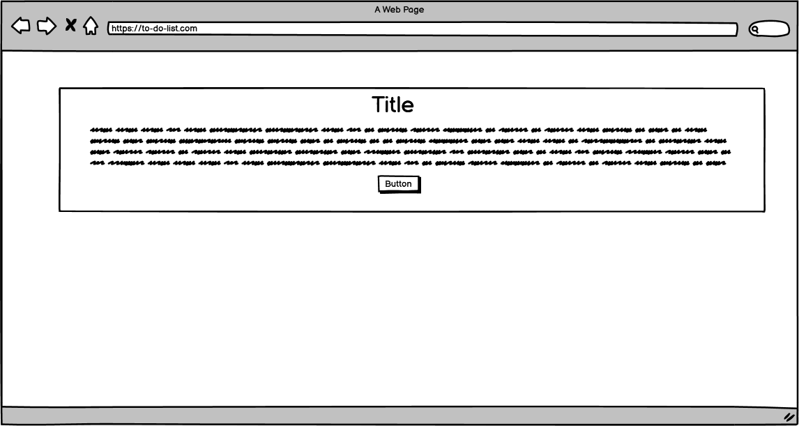
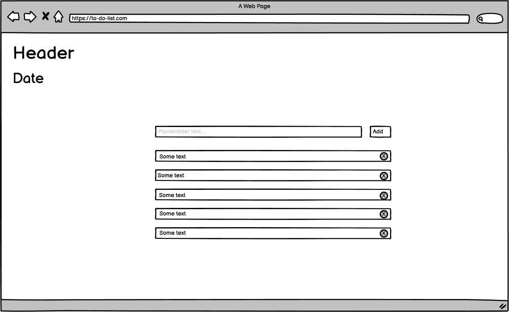

# To-Do-List

To do list is a basic application that can be used to create a list of tasks that you need to get done. It offers users the ability to type in tasks they need to complete. The applicaton will then populate a list for the user. The user can delete task that are no longer required. The user can strikethrough completed tasks.

Link to published application: https://lornavav.github.io/to-do-list/ 

## Application Goals

The goal of this application is to offer users a way of managing their tasks on a daily basis. 

## User Stories

## UX

* Strategy

* Scope

* Structure

* Skeleton

* Surface

### Wireframes

Mobile wireframes with modal and with modal closed.

Tablet wireframes with modal and with modal closed.

Desktop wireframes with modal and with modal closed.

### Design Choices

* Colour Scheme

* Typography

## Features

### Existing Features

### Future Features

### Testing

## Validator Testing

## Mannual testing

## Bugs

### Unfixed Bugs

## Deployment

## Credit

## Content

## Technologies Used

### Languages

### Frameworks and Tools
