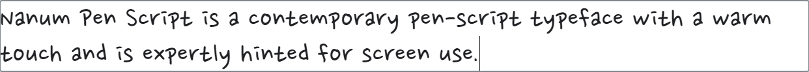
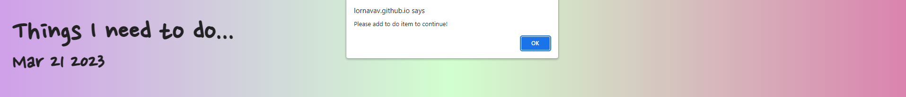
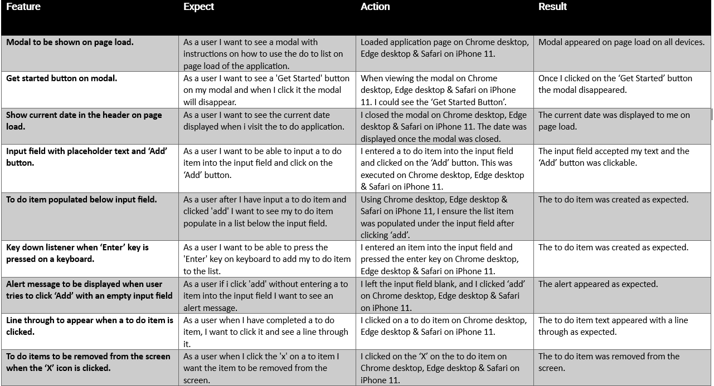

# To-Do-List

To do list is a basic application that can be used to create a list of tasks that you need to get done. It offers users the ability to type in tasks they need to complete. The applicaton will then populate a list for the user. The user can delete tasks that are no longer required. The user can strikethrough completed tasks.

Link to published application: https://lornavav.github.io/to-do-list/ 

## UX

### Application Goals

The goal of this application is to offer users a way of managing their tasks on a daily basis.

### User Stories

 * As a user I want to see a modal with instructions on how to use the do to list on page load of the application. 
 * As a user I want to see a 'Get Started' button on my modal and when I click it the modal will disappear.
 * As a user I want to see the current date displayed when I visit the to do application.
 * As a user I want to be able to input a to do item into the input field and click on the 'Add' button.
 * As a user after I have input a to do item and clicked 'add' I want to see my to do item populate in a list below the input field.
 * As a user I want to be able to press the 'Enter' key on keyboard to add my to do item to the list.
 * As a user if i click 'add' without entering a to item into the input field I want to see an alert message.
 * As a user when I have completed a to do item, I want to click it and see a line through it.
 * As a user when I click the 'x' on a to item I want the item to be removed from the screen.
 
## UX

* Design Choices

    * Colour Scheme

    I took the inspiration for a gradient background scheme from [Web Dev Tutorials](https://www.youtube.com/watch?v=H5tuwAO-_Kg). I just played around with some hex codes from there and came up with this scheme.
    
    

    * Typography 

    I wanted the font to look like handwriting so that it would like a traditional style list. Like one you would create with a pen and paper. Using google fonts I discovered Nanum Pen Script.

    
    

## Wireframes

* [Mobile wireframes](documentation/images/mobile_wireframes.png)

* [Tablet wireframes](documentation/images/tablet_wireframes.png)

* [Desktop modal wireframe](documentation/images/desktop_popup_wireframe.png)

* [Desktop wireframe](documentation/images/desktop_wireframe.png)

## Features

### Existing Features

* Modal
 
   * The modal will appear as soon as the user tries to access the application. The modal has an overlay which shields the main page for the user. 
   * The user must read the instructions and click on the 'Get Started' button to view the application page.
   * The modal will reappear each time the page is refreshed.

 

* Header
 
   * The header sections show the user the title of the application. It also displays the current date.

 

* To do input and task list
 
   * Here we will see the input box that the user can type the to do item into.
   * The 'Add' button which will then add the item to a to do list.
   * The user can also press the 'Enter' key on a keyboard to add the task to the to do list.
   * The user can click on a to do item and it will strike through the text meaning the task has been completed.
   * The user can press the 'X' button, and this will remove the task from the screen.

 

 * Alert Message

   * An alert message will be displayed if the user clicks 'Add' or presses 'Enter' without entering any text into the input field.

  

### Future Features

 * I would like to add some statistics to the application such as total tasks, completed tasks, tasks remaining.
 * Implement a login in feature for each user, where their to do lists are saved and are not lost on browser refresh.
 * Validation on input field for example no duplicate tasks can be added. 

## Testing

### Validator Testing

* [Jshint validation](documentation/images/jshint_validation.png)

* [CSS validation](documentation/images/css_jigsaw_validation.png)

* [HTML validation](documentation/images/html_w3c_validation.png)

* [Accessibility report](documentation/images/wave_accessibility_report.png)

### Manual testing

* Site responsiveness testing with supporting screenshots using [Responsive Design Testing](https://responsivedesignchecker.com/)

  * [iPhone 3/4/4S Modal](documentation/images/iphone_3_4_4s_responsiveness.png)

  * [iPhone 3/4/4S Main](documentation/images/iphone_3_4_4s_responsiveness_main.png)

  * [iPad Mini Modal](documentation/images/apple_mini_responsivness.png)

  * [iPad Mini Modal](documentation/images/apple_mini_responsivness_2.png)

  * [22" Desktop Modal](documentation/images/22inch_desktop_responsiveness.png)

  * [22" Desktop Main](documentation/images/22inch_desktop_responsiveness-2.png)

* All default devices found on Chrome dev tools were all tested on, and all were compatable with the application.

* Manual testing based on user stories 

## Unfixed Bugs

* There are no unfixed bugs that I am aware of.

## Deployment

* To deploy the website i followed the below steps

  * I logged into GitHub.
  * From the correct repository I selected the settings icon.
  * I selected 'pages' from the code and automation section on the left-hand side.
  * From the 'build and deployment' section I selected 'Deploy from a branch'.
  * From the 'branch' section I selected 'main' from the branch drop down list.
  * I made sure that the /(root) folder was selected and pressed save.
  * I refreshed the page and underneath 'GitHub Pages' I could see the link to the live site.

* For forking the repository please follow the below steps

  * Log into Github.
  * Navigate to the desired repository.
  * On the top right of the page click on the 'Fork' button.
  * There will now be a copy of the original repository in your Github account.

## Credit

### Content

 * Inspiration on styling and how to input and add tasks to a list taken from [Web Dev Tutorials](https://www.youtube.com/watch?v=H5tuwAO-_Kg).
 * Date feature inspiration taken from [Web Dev Tutorials](https://www.youtube.com/watch?v=SeKQSQDUMDQ).
 * 404 page created by following steps pinned by Karina on CI Slack channel #project-milestone-1.
 * Inspiration for modal came from [Moira Hartigan](https://moirahartigan.github.io/Portfolio-2---Alien-Memory-Game/index.html) whos project i found on the CI Slack channel #peer-code-review.
 * Favicon created on https://gauger.io/fonticon which I found through https://github.com/bradtraversy/design-resources-for-developers an excellent resource sent to me by my facilitator Paul Thomas.

### Technologies Used

## Languages

 * HTML - Used to create basic application structure.
 * CSS- Used to add design element to the application.
 * JavaScript - Used for interactive features of the application.

## Frameworks and Tools

 * [Balsamiq](https://balsamiq.com/) for wireframing.
 * [Google Fonts](https://fonts.google.com/) for browsing fonts and importing chosen font.
 * [Font Awesone](https://fontawesome.com/) for icon used for removing to do list item.
 * [Coolors](https://coolors.co/) for displaying my colour scheme.
 * [GitHub](https://github.com/) used to host repository and deploy project through GitHub pages.
 * [Gitpod](https://gitpod.io/) used to develop my project.
 * [Responsive Design Checker](https://responsivedesignchecker.com/) for screenshots of responsive design.
 * Chrome developer tools used to check device responsivness and debugging any errors encountered.
 